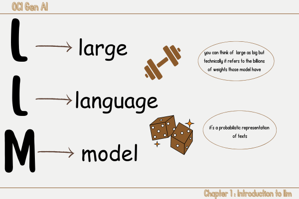
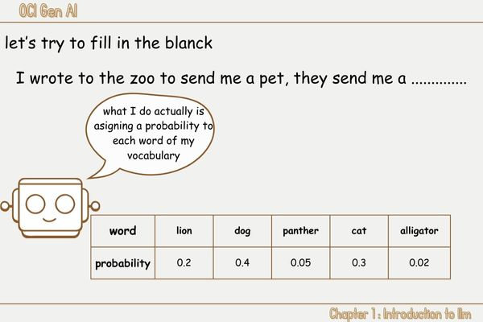
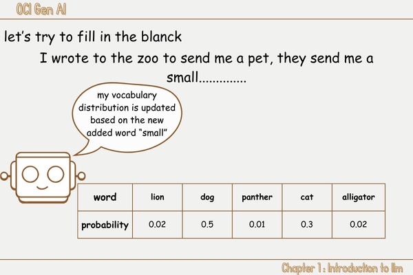
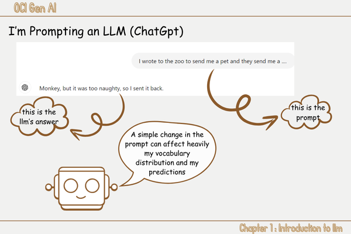

# 1️⃣ Introduction to LLM 
<link rel="stylesheet" href="../css/style.css">
<head>
    <meta charset="UTF-8">
    <meta name="viewport" content="width=device-width, initial-scale=1.0">
    <title>1️⃣ Introduction to LLM </title>
</head>
In this chapter we will dive into <u class="underline">the world of llm</u> starting by its definition, exploring  some of <u class = "underline">prompting techniques</u> then we will learn about the <u class="underline" >issues of prompting</u>
and  <u class="underline">the training and its techniques</u> as a solution and finally  we will talk about  some related concept such as <u class="underline">decoding</u>,<u class="underline">hallucination</u> and finally <u class="underline">groundness and Attributability</u>.

## LLM definition 
LLM stands for large language model and what i want you to keep in mind the meaning of  these three words:

</img> 
<u class="underline">
Large language models</u> are models that can understand and generate text using a probability distribution of words. It's fair if you wonder what a model is in the first place. We can compare a model to a representation or a schema. This model has some weights or parameters<a href="#fn1"> 1 </a>, and our goal in this exciting journey is to find the best weights that our model can have<a href="#fn2"> 2 </a>. This representation relies solely on the distribution of words.
let's try to illustrate this:

 
 the llm calculates the probability of appearance of each word present in its vocabulary and based on this distribution it gain some kind of understanding of the semantic meaning of texts, for example our model assigned a probability of O.4 and 0.3 to dog and cat respectively, with each new word we try to predict the model will calculate and assign a new probability distribution over its vocabulary.
 
 

we can see clearly that the probability distribution of our model changed when we added the word small. You may notice that small animals gets higher probabilities than before, which mean they are more likely to be the suitable ones.

At this stage you may notice that all the power of a llm is hidden within those distributions.
If we can control them, change them the way we want,we ultimately end up with what we want.

🤔💭 how can we change the probability  distribution over an llm vocabulary❓ 
there two ways we can change the distribution:
- prompting
- training

in the next part we will discover what is prompting, its strategies and finally its limitations.

## Prompt Engineering and its Strategies
Because having the right definition setted in place is what we all need to understand the concept let's make it clear: 
🤔💭 what's a <u class="underline">prompt</u>❓ 
🤔💭 what does <u class="underline">prompt engineering</u> mean exactly❓

👉 Prompt can have different meanings,it refers to the text used as input to an llm it can contains instructions and examples<a href="#fn3"> 3 </a>.
 
👉 Prompt engineering is defined as the process of refining the prompt for the purpose of elicting a specific style of response.<a href="#fn3"> 3 </a>.

I can feel that's it's a little bit 😶‍🌫 in your mind but we will take it one step at a time:

I think you are already familiar with AI(artificial intelligence) assistance tools such as:

- GPT (from Open IA)
- Copilot (from microsoft)  
and the list goes on, whener you use one of these tools you are prompting it to do something by just writing so what you type is called the prompt:
 

💡 keep in mind that with just prompting we have the power to change the probability distribution over vocabulary, always remember what happened when we just added the word <b>small</b> in our previuous example. 

<u class='underline'>Prompt Engineering</u> rely on some strategies and techniques:

## Prompt Engineering's Issues
## Training instead of prompting
## Important Concept 

<ol>
    <li id="fn1">Weights or parameters are the values that the model adjusts during training to minimize error and improve accuracy. It has billions of them, which makes it a large model. <a href="#fnref1">↩</a></li>
    <li id="fn2">The best weights are those that allow the model to make the most accurate predictions or generate the most coherent text. For more details, check the architecture of large language models (LLM). <a href="#fnref2">↩</a></li>
    <li id="fn3">Those definition were provided within the original course <a href="#fnref3">↩</a></li>
</ol>