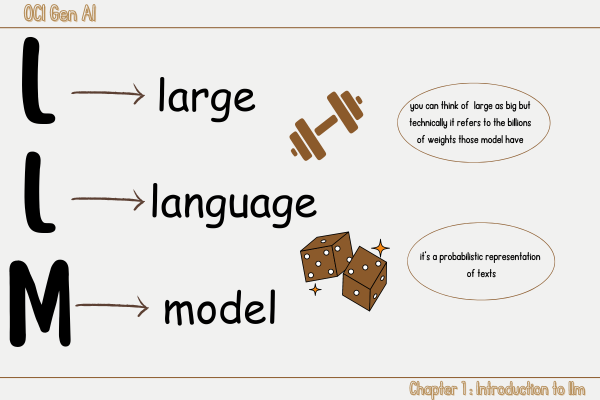

# 1️⃣ Introduction to LLM 
<link rel="stylesheet" href="../css/style.css">
In this chapter we will dive into <u class="underline">the world of llm</u> starting by its definition, exploring  some of <u class = "underline">prompting techniques</u> then we will learn about the <u class="underline" >issues of prompting</u>
and  <u class="underline">the training and its techniques</u> as a solution and finally  we will talk about  some related concept such as <u class="underline">decoding</u>,<u class="underline">hallucination</u> and finally <u class="underline">groundness and Attributability</u>.

## LLM definition 
LLM stands for large language model and what i want you to keep in mind the meaning of  these three words:

<u class="underline">
Large language models</u> are models that can understand and generate text using a probability distribution of words. It's fair if you wonder what a model is in the first place. We can compare a model to a representation or a schema. This model has some weights or parameters<a href="#fn1">1</a>, and our goal in this exciting journey is to find the best weights that our model can have<a href="#fn2">2</a>. This representation relies solely on the distribution of words.
 let's try to illustrate this:

## Prompt Engineering and its Strategies

## Prompt Engineering's Issues

## Important Concept 

<ol>
    <li id="fn1">Weights or parameters are the values that the model adjusts during training to minimize error and improve accuracy. It has billions of them, which makes it a large model. <a href="#fnref1">↩</a></li>
    <li id="fn2">The best weights are those that allow the model to make the most accurate predictions or generate the most coherent text. For more details, check the architecture of large language models (LLM). <a href="#fnref2">↩</a></li>
</ol>