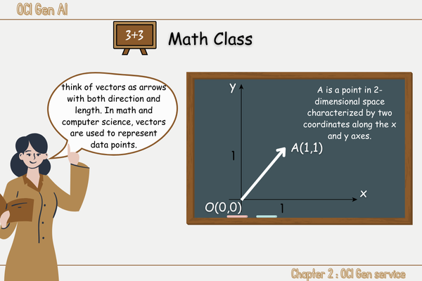
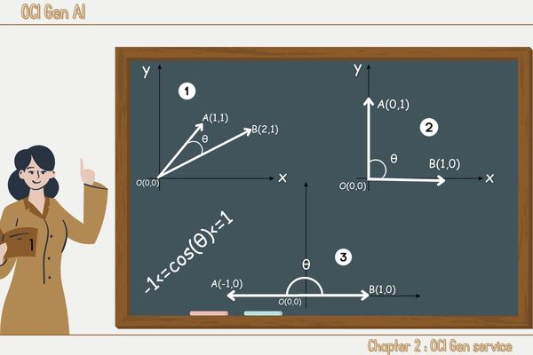
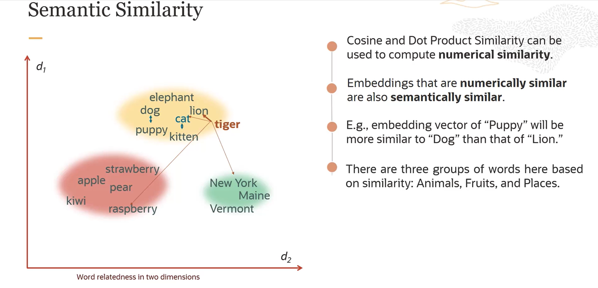

# 2️⃣ OCI Gen service 
<link rel="stylesheet" href="../css/style.css">
<head>
    <meta charset="UTF-8">
    <meta name="viewport" content="width=device-width, initial-scale=1.0">
    
</head>

Welcome to the second part of this learning journey where we are going to focus on OCI Gen Service that stands for Oracle Cloud Infrastructure Generative Service, the original course focused on Oracle's Services of generative AI but some of the concept will explored in a more broader sense.

Let's try to break everything piece by piece so we can move on a solid background together👭.

At this point we can have a sense of how llm are big(in term of weights ofc),how greedy they are in term of computational ressources and time those caracteristics hinder our ability to run them locally using our own devices(🤫 in fact it's not impossible but it will take a lot of time and not every devices will be suitable) 🤔 isn't problematic,there is a need,and  as you might know before “The presence of a need creates opportunities for companies to innovate and grow"
🪄Abracadabra! 🎩✨ The <u class = "underline">The cloud</u> was born as a solution to this problem

Let me explain the whole idea to you.

Big tech companies such as google,oracle and others have their own datacenters(Just Imagine them as big houses where big computers soo powerful ones are hosted) we call all this connected computers and all technical details that make the computational ressources available for final users an infrastructure, and actually as a client you don't need to know all these hidden details but they generally provide an interface where you can allocate the ressources you need for your task.
those ressources range from CPU,GPU and Memories.

Hope it more clear now,now let’s return to our primary objective.

Oracle as a biig company has its own cloud known as oci (Oracle Cloud Infrastructure) who provides the ressources discussed above, It support also GenAI(generative AI)
which provide the ressources needed(dedicated AI clusters)<a href="#fn5">1</a>

oracle provide a range of llama and cohere models you can use from text generation,summarization to embedding models each one with some parameters you can control. let's try to get a closer look at each of them.

✨ <u class='underline'>Generative Models</u>: as their name suggest they are models that are mostly performant in text generation task
and  they come with some parameters you can choose and modify:
- maximum output tokens

the maximum number of genrated tokens(token can be a word, part of a word or a ponctuation mark)
- temperature

a parameter that control how creative the model should be and the randomness of llm output
here i need to explain what do we mean by a creative model and how i cloud be🎨
the model can either be deterministic or non deterministic
determinstic models🪐 tend to apply
 <u class='underline'>Greedy Decoding🤑</u> where the word generated is the word with the highest probability

 non deterministic models🎲 tend to use some other way of decoding such as nuclus sampling,beamseach but the general idea remains the same we want to select this time the word with the lowest probability by making the distribution flattened over all worlds, which mean they appear rarely, the temperature is a parameter that can control the nature of the model.

 temperature = 0 ➜ 🪐

 temperature > 0 ➜ 🎲 ➜ 🎨

 
- Top p,Top k

are just other parameters you can set beside temperature  to control the output.
- Presence,frequency and penalty

they are parameters that will assign a penalty if a word appears frequently, the final result will contains less repetitive words.

<u class='underline'>Frequency</u> Apply the penalty based on the  number of times a word appear in the generated text including the prompt.

<u class='underline'>Presence</u>
Apply the penalty regardless of the frequency, if a word appears just one time it gets penalyzed.

-StopSequencing: is the string that tell you model to stop generating output in order to control your model output
- Showlikelihood

It's a parameter that control the token generation, all tokens are assigned a value in the range [-15,0],
the ones with the highest number are mostly likely to follow the current token.

✨ <u class='underline'>Summarization Models</u>: using the same text generation models we can now summarize but using differents parameters:

- temperature

- length

Approximative length of the summary(short,medium,long)

- format

Control the display of the summary(bullet point or free form paragraph)

- extractiveness: 

It control how much to reuse the input in the generated summary

⬆️  higher values mean that the model will use the words that already exist in the sentence.

⬇️ lower ones mean that the model will try to paraphrase.

Let’s shift our focus to the final model

✨ <u class='underline'>Embedding Models</u>:
Embedding mean actually transforming  text to numerical representation but why🤷‍♂️? 
because

👉 computers and models can only handle numerical representations

👉 we can capture properties of words

👉 we can evaluate semantic similarities

I know it's start to get foggy with new words and concepts and as usually let's break down to small chunks we can handle 🤹🏻

when we refer to the term word embeddings it's as i said before transforming word to vector, If  you are not familiar with vectors

here is a quick math course 𝞹📈🧠📚

 

</img> 

👨🏻‍🏫 The Arrow is what we call a vector, it's a link showing the start(origin), which road we should follow(direction) and how much distance we need to traverse(length).

in the example above the start is the origin often denoted as O(0,0) and the destination is the point A(1,1)
and OAit's a vector, since we have only two axis to locate a point we are in a 2-dimentional space,then all the entities will be located using two coordinate x and y
even  the vector. 

This is the rule 📝:

❝To calculate the vector coordinates from two points, you subtract the coordinates of the starting point from the coordinates of the ending point.

Given two points A(x1, y1) and B(x2, y2), the vector {AB} (with an arrow above) that points from  A to B is calculated as:

vec{AB} = (x2 - x1, y2 - y1)❞

💪 simple task:

find the  coordinates of vector vec{OA} in our example.

Keep in mind🧠 in our real world you can thing of vectors as a long sequence of numbers, each one is  a location according to a specific axis, the number of axis or components of a vectors it's actually the dimension of that space.

Okey but how vectors are soo useful and how they encapsulate all those details, in fact for the word puppy and its embedding which is in our case 🐶(1,1)           each component of the vectors represent a caracteristic for example the first one represent the size, the second one the age etc,now you can clearly see how word embedding capture the properties of words, moving no to the third point which is semantic and this is the rule
📜 ❝Words with similar meanings will have similar vectors.❞ make sense,isn't but how can we measure this semantic similarity actually we use cosine or dot procut, wait a minute I will bring my board 👨🏻‍🏫.

</img> 

I know new formula and expression let's try to dive deeper into each one  of them:

- Dot Product: we can calculate the dot product using the first formula on the board

💪 simple task:

find the dot product of vector vec{OA}  and  vector {OB} in our example.
😉(hint) try to find the OA and OB coordinates before tackling the task

- Cosine of the angle between two vectors: the second formula comes handy for doing so, but wait a minute what's the || || symbole, actually it's the length of a vector and it's calculated using the last formula

💪 challenging task:

find the cosine of the angle between vector {OA} and {OB}.
😉(hint) try to find the length of vector {OA}
and {OB} first and then use the result of your dot product to answer.

I know, so much informations and maybe you still can't find how all this fit within the big picture of words and embeddings, If you're reading this, congratulations! You've come a long way—bravo!🎉🎉👏. 

📜 ❝Everything will reveal itself in time and the time has come❞

if you already tried the tasks i provided it will make sense to you, if not i suggest that you try them out before moving to the next part.
🐾 here are the steps to follow to find the cosine of angle between two vectors:
- vector's coordinates calculation
- Dot product calculation
- vector's length calculation 
- cos(θ) calculation

Now it looks as if our mission from the start was just finding the value cos(θ) but why🤔? 

I tried to demonstrate  on the board some of the extreme position of vectots in a 2-Dimentional space
</img> 

You can try to calculate the cos(θ) in each of the three scenarios but want I'm trying is just giving you a visualisation that some of the cases that might exist.

The heart -`♡´- of the issue lies in the following conclusions:

- Cosine similarity ranges from -1 to 1:
- 1 means the vectors are identical in orientation (i.e., they point in the same direction).
- 0 means the vectors are orthogonal (i.e., they have no similarity).
- -1 means the vectors are diametrically opposed (i.e., they point in exactly opposite directions).
take a breath if you feel like you need it😮‍💨, take a break if you feel overwhelmed ☕, then try to find the relationship between what we have seen and <b>Semantic Similiraties</b>.

All what we just seen is illustrated in this picture.

</img> 

📜 ❝The true importance of anything is best demonstrated through its use cases and applications❞ 

embeddings have several use cases:

👉 translation which is actually sentence to sentence generation,at this stage I want you to keep in mind that  there is some techniques that help the model understant and  generate text with multiple languages.

👉 RAG(Retrieval Augmented Generation) We encountered this word earlier can you remember where exactly, close your eyes 🫣 and try to recall where exactly,
open your eye 😀 and 
Let me give the answer

we discussed RAG as a technique used to reduce hallucinations in llm(🥺 it's completly fine if you can't get it right), I promessed that we will go into more details later on,now  I fulfill what I promised.

now suppose that you have a company that sell clothes👕 and you want to ensure an online presence so you decided to build your own website, and because answering the questions of your clients is a primary preoccupation for your company, maybe you can think of deploying a chatbot to answers their questions, but don't forget that a chatbot is one application of llm ,llm especially a base model have only a general knowledge, it can answer the question who is the king of morocco? but it will hallucinate when asked what kind of clothes are avaible in your company?.

💡 you might think, okeey then i should give it a knowledge, one technique we covered in chapter1 is finetuning but always remember that finetuning remains computionally expensive task, RAG come as a solution.

👉 [Chapter 3 : building block of an llm application 🛠️](./Chapter3.md)

<ol>
    <li id="fn1"><a href="#fnref1">↩</a></li>
    <li id="fn2"><a href="#fnref2">↩</a></li>
    <li id="fn3"> <a href="#fnref3">↩</a></li>
    <li id="fn4"><a href="https://towardsdatascience.com/in-context-learning-approaches-in-large-language-models-9c0c53b116a1">↩</a></li>
     <li id="fn4"> <a href="https://www.datacamp.com/tutorial/how-transformers-work">↩</a></li>
    <li id="fn5"><a href="#fnref5">↩</a></li>

    
</ol>