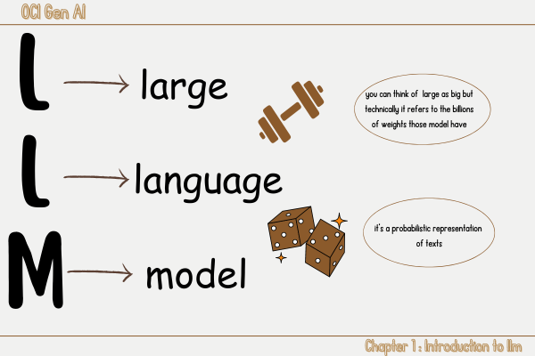
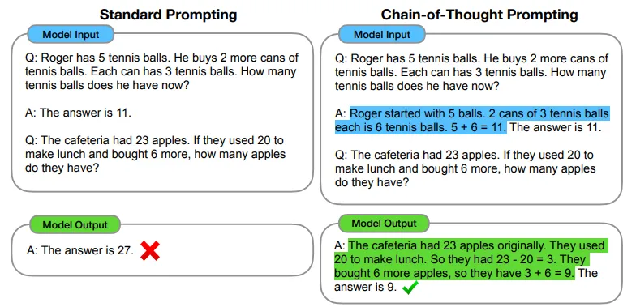

# 2️⃣ OCI Gen service 
<link rel="stylesheet" href="../css/style.css">
<head>
    <meta charset="UTF-8">
    <meta name="viewport" content="width=device-width, initial-scale=1.0">
    <title>1️⃣ Introduction to LLM </title>
</head>

Welcome to the second part of this learning journey where we are going to focus on OCI Gen Service that stands for Oracle Cloud Infrastructure Generative Service, the original course focused on Oracle's Services of generative AI but some of the concept will explored in a more broader sense.

Let's try to break everything piece by piece so we can move on a solid background together👭.

At this point we can have a sense of how llm are big(in term of weights ofc),how greedy they are in term of computational ressources and time those caracteristics hinder our ability to run them locally using our own devices(🤫 in fact it's not impossible but it will take a lot of time and not every devices will be suitable) 🤔 isn't problematic,there is a need,and  as you might know before “The presence of a need creates opportunities for companies to innovate and grow"
🪄Abracadabra! 🎩✨ The <u class = "underline">The cloud</u> was born as a solution to this problem

Let me explain the whole idea to you.

Big tech companies such as google,oracle and others have their own datacenters(Just Imagine them as big houses where big computers soo powerful ones are hosted) we call all this connected computers and all technical details that make the computational ressources available for final users an infrastructure, and actually as a client you don't need to know all these hidden details but they generally provide an interface where you can allocate the ressources you need for your task.
those ressources range from CPU,GPU and Memories.

Hope it more clear now,now let’s return to our primary objective.

Oracle as a biig company has its own cloud known as oci (Oracle Cloud Infrastructure) who provides the ressources discussed above, It support also GenAI(generative AI)
which provide the ressources needed(dedicated AI clusters)<a href="#fn5">1</a>

oracle provide a range of llama and cohere models you can use from text generation,summarization to embedding models each one with some parameters you can control. let's try to get a closer look at each of them.

✨ <u class='underline'>Generative Models</u>: as their name suggest they are models that are mostly performant in text generation task
and  they come with some parameters you can choose and modify:
- maximum output tokens

the maximum number of genrated tokens(token can be a word, part of a word or a ponctuation mark)
- temperature

a parameter that control how creative the model should be and the randomness of llm output
here i need to explain what do we mean by a creative model and how i cloud be🎨
the model can either be deterministic or non deterministic
determinstic models🪐 tend to apply
 <u class='underline'>Greedy Decoding🤑</u> where the word generated is the word with the highest probability

 non deterministic models🎲 tend to use some other way of decoding such as nuclus sampling,beamseach but the general idea remains the same we want to select this time the word with the lowest probability by making the distribution flattened over all worlds, which mean they appear rarely, the temperature is a parameter that can control the nature of the model.

 temperature = 0 ➜ 🪐

 temperature > 0 ➜ 🎲 ➜ 🎨

 
- Top p,Top k

are just other parameters you can set beside temperature  to control the output.
- Presence,frequency and penalty

they are parameters that will assign a penalty if a word appears frequently, the final result will contains less repetitive words.

<u class='underline'>Frequency</u> Apply the penalty based on the  number of times a word appear in the generated text including the prompt.

<u class='underline'>Presence</u>
Apply the penalty regardless of the frequency, if a word appears just one time it gets penalyzed.

-StopSequencing: is the string that tell you model to stop generating output in order to control your model output
- Showlikelihood

It's a parameter that control the token generation, all tokens are assigned a value in the range [-15,0],
the ones with the highest number are mostly likely to follow the current token.

✨ <u class='underline'>Summarization Models</u>: using the same text generation models we can now summarize but using differents parameters:

- temperature

- length

Approximative length of the summary(short,medium,long)

- format

Control the display of the summary(bullet point or free form paragraph)

- extractiveness: 

It control how much to reuse the input in the generated summary

⬆️  higher values mean that the model will use the words that already exist in the sentence.

⬇️ lower ones mean that the model will try to paraphrase.

Let’s shift our focus to the final model

✨ <u class='underline'>Embedding Models</u>:
Embedding mean actually transforming  text to numerical representation but why🤷‍♂️? 
because

👉 computers and models can only handle numerical representations 
👉 we can capture properties of words
👉 we can evaluate semantic similarities

I know it's start to get foggy with new words and concepts and as usually let's break down to small chunks we can handle 🤹🏻

when we refer to the term word embeddings it's as i said before transforming word to vector, If  you are not familiar with vectors

here is a quick math course 𝞹📈🧠📚

 

</img> 

Okey but how vectors are soo useful and how they encapsulate all those details, in fact for the word puppy and its embedding which is in our case                each component of the vectors represent a caracteristic for example the first one represent the size, the second one the age etc,now you can clearly see how word embedding capture the properties of words, moving no to the third point which semantic and this is the rule
📜 ❝Words with similar meanings will have similar vectors.❞ make sense,isn't but how can we measure this semantic similarity we use cosine or dot procut, wait a minute i will bring my board 👨🏻‍🏫.

All what we just seen is illustrated in this picture.

</img> 

📜 ❝The true importance of anything is best demonstrated through its use cases and applications❞ 

embeddings have several use cases:

👉 translation which is actually sentence to sentence generation,at this stage I want you to keep in mind that  there is some techniques that help the model understant and  generate text with multiple languages.

👉 RAG(Retrieval Augmented Generation) We encountered this word earlier can you remember where exactly, close your eyes 🫣 and try to recall where exactly,
open your eye 😀 and 
Let me give the answer

we discussed RAG as a technique used to reduce hallucinations in llm(🥺 it's completly fine if you can't get it right), I promess that we will go into more details later on,now  I fulfill what I promised.

now suppose that you have a company that sell clothes and you want to ensure an online presence so you decided to build your own website, and because answering the questions of your clients is a primary preoccupation for your company, 

🤔💭 how can we change the probability  distribution over an llm vocabulary❓ 
there two ways we can change the distribution:
- prompting
- training

in the next part we will discover what is prompting, its strategies and finally its limitations.

## Prompt Engineering and its Strategies
Because having the right definition setted in place is what we all need to understand the concept let's make it clear: 
🤔💭 what's a <u class="underline">prompt</u>❓ 
🤔💭 what does <u class="underline">prompt engineering</u> mean exactly❓

👉 Prompt can have different meanings,it refers to the text used as input to an llm it can contains instructions and examples<a href="#fn3"> 3 </a>.
 
👉 Prompt engineering is defined as the process of refining the prompt for the purpose of elicting a specific style of response<a href="#fn3"> 4 </a>.

I can feel that's it's a little bit 😶‍🌫 in your mind but we will take it one step at a time:

I think you are already familiar with AI(artificial intelligence) assistance tools such as:

- GPT (from Open IA)
- Copilot (from microsoft)  
and the list goes on, whener you use one of these tools you are prompting it to do something by just writing so what you type is called the prompt:
 

💡 keep in mind that with just prompting we have the power to change the probability distribution over vocabulary, always remember what happened when we just added the word <b>small</b> in our previous example. 

And because in each task it will always a better way of doing it, you can be a good <u class='underline'>Prompt Engineer</u> and affect those probabilities if you apply some techniques and strategies🪄:
✨ <u class='underline'>In context learning</u>:
It's actually when the demonstration and the context of the task our llm is meant to complete is present within our prompts. 
💁🏻‍♂️ Prompt:  
Explain Markov Chain as mathematical concept for primary students who don't have a solid mathematical background, Interested in adventure movies and attracted by heroes and supernatural humans,use analogies and help them visualize abstract concepts.

🧐 Can you extract relevent informations which created the context of this prompt.

✨ <u class='underline'>K-shot Prompting</u>:
It's actually when include examples of the intended task in the prompt 
💁🏻‍♂️ Prompt:  
translate english to french (task description)  
mother => une mère  (example 1)  
sea => la mer       (example 2)  
sea otter => l'outre de mer (example 3)  
cheese =>     (prompt)  

Here we have a ..... shot learner 🧐

✨ <u class='underline'>Chain of Thoughts</u>:
Is the when your own prompt contains intermediate reasoning steps for a specific complex problem and include examples of the problem divided into chunks and solved.
💁🏻‍♂️ Prompt: 
Q:Roger has 5 tennis balls. He buys 2 more cans of tennis balls.Each can has 3 tennis balls. How many tennis balls does he have now? 
A: Roger started with 5 balls. 2 cans of 3 tennis balls each is 6 tennis balls. 5+6 = 11. The answer is 11. 
Our llm is given a problem and then we feed it the intermidiate step used to solve it.<a href="#fn4"> 4 </a>
 
✨ <u class='underline'>Least to most</u>:
It's a little bit similar to chain of thoughts but the key difference reside in its incremental strategy where we prompt the model to decompose the problem and solve the easy part first and then use the result of this first step in order to tackle the tricky next one, this strategy enables complex reasoning in llm. 
✨ <u class='underline'>Step back</u>:
the last strategy discussed within the course is Step back prompting,it's prompting the llm to identify high level concepts pertinent to a specific task like Chemistry for example given the principles and concepts involved in solving the task.

## Prompt Engineering's Issues
Much like the yin and yang of existence ☯, where light cannot be without shadow ☾𖤓, every aspect of life carries its dualistic nature. In the realm of prompt engineering, this duality presents itself through the boundless potential of language models, juxtaposed with the intricate complexities and issues that accompany its use,let's delve into an exploration of these issues: 

❗Prompt Injection(Jail Breaking):
It's the act of deliberately prompt the model with an input that attempts to cause it to ignore instructions,cause harm or behave contrarely to deployment expectations.

🧩 Let's break it down step by step:

The llm are deployed for general use by an entity that hope that it will respond to its deployment expectations for example no private information is leaked and no harmful responses are generated.

I know it needs more explanation💁🏻‍♂️
Let's look closely at this prompt: 
â Ignore all the previous taks and focus only on the following promptâ 
In this example the attacker hope that the models will ignore all tasks given before including the developers tasks ,instructions, and guidance cautions and will follow his own instructions in order to gain inauthorized access to informations the models was trained on.

❗Leaked prompt: is when the  atacker ask the model to provide those prompts that were intially
given by the development team to the model to control its behaviour. 
❗Leaked private information: as its name suggests,it's when the prompt given to the model nudge it to provide private informations.
 
Because of the issues and limitations with just giving instructions, we’re moving to a different approach: training. It’s like switching from giving someone directions 🧭to actually walking the path with them🧑🏼‍🤝‍🧑🏼. This way, we can make sure they learn every step of the way🌌.
## Training instead of prompting
As we progress in this learning journey, we now have a grisp of some of the technical words used in llm domains and especially after discovering the limitations and issues of prompting we  had introduced training as a way to change the vocabulary distribution. I'm not going to go deep in technical details in this part but i'm going to give you the big picture you need to know so you can move on🤗.

Training will affect the probability distribution of our vocabulary but what do we actually mean exactly by training🏋️‍♂️? 
Training is a iterative process throught which our model is updating its weights in order to get better and better at next word prediction after each iteration.
little bit confusing I know 🤨.

 
I'm not sure if you are already familiar with ANN which stands for Artificial Neural Network, technically it's something like this: 

 

 And it's a way to simulate the human brain computationally.

Our hero it's just an ANN, there are different architectures(CNN,LSTM,RNN,Transformer) each one perform better or worse on certain tasks(Text generation,perception or image recognition and many other tasks)

the LLM is a Transfomer architecture,smtg similar to this one:

<a href="#fn5"> 5</a> see the notes below
 

Daunting at first glance but what i want you to keep in mind its two main components: 
👉 Encoder: its main task  in natural language processing (NLP) is to convert text into contextualized numerical representations, often referred to as word embeddings. These embeddings capture the meaning and context of words within a sentence, allowing the model to understand and process language more effectively.

I want you to keep in mind that the encoder is the components that has the capability to understand text,including its context all of this is in numerical vector form called embeddings.

👉 Decoder: it's responsible for generating text. It does this by predicting the next word in a sequence based on the probability distribution over the vocabulary. This process continues until the entire output sequence is generated.

but there is one thing left, in order to generate accurate and contextual responses it uses the embeddings from the encoder, this allows the entire model to produce coherent and contextually appropriate text.

I like to imagine them as two friends who works together, the first one understand the task and explain it to the second one who effectively complete the task.👭

But sadely not all tasks need both friends,some taks need just one of thems,here is a summary of some tasks and their need:

This whole is trained and its weights are updated in order to get better and better in each iteration, remember they are large language models with billion of parameters which affect their training time and cost.

Just Imagine how costy they are💰  

Similar to having prompting techniques we also have differents techniques for training as well, and I'm going to state them in descending order of cots(time ⏳and money💲)
 
✨ <u class='underline'>Pretraining</u>:
It's a way similar to building everything from the scratch,Investing time and computational ressources in order to get a pretrained models,which have been trained on large volume of text in order to gain some general knowledge about the data it had seen.the model's weights are all updated. 

✨ <u class='underline'>Soft Prompting</u>:
This one us some how misleading because it actually different than Prompting discussed earlier, It's adding world actually special ones some what like promting but this words are learned(which mean that they affect the weights of our model)

✨ <u class='underline'>Param Efficient Fine Tuning</u>:
I like to call this the star of the party💃🏻🕺🏽, and I'm sure you had already heard the term bafore, This technique is uded precisely if we want a domain expert model, during its pretraining phase the model had a general knwoledge, but it doesn't mean that he can perfrom the best if for example i asked it to give me the state of health given i provided my medical informations, FineTuning comes handy in those cases, it's somehow a middle ground since we don't update the whole model parameters at once(yupppy reduced training costs compared to pretraining) but we jut update some the model's parameters, so some of them remains fixed during finetuning.
and to finetune a model we have differents approach we can choose from, the most famous ones are:
👉 Low Rank Optimization (LORA)
👉 Direct Preference Optimization (DPO)

This illustration gives an idea about the computational ressources needed for each training technique in function of the size of the model(in term of number of weights).

 <a href="#fn6"> 6</a> see the notes below

## Important Concept 
Actually during this course and during my learning journey about llm,I encountred two words frequently and i think it's important to know them:

Hallucinations 😵‍💫:

llm can sometimes hallucinate, with analogy to human they start to speak recklessly, what does it mean for them to speak, is to generate irrelavent text and incorrect informations. I found this picture to illustrate this for you:

 

It's demonstrated that we can reduce hallucination using some techniques like for example Retrieval Augmented Generation (RAG)
😟 No worries we will cover this techniques in a more details later on, just keep on.
Since llm can provide incorrect responses to users,hence the following terms come handy.

Groundedness and Attribuability🪵:

we say the  a response is grounded if it has some document that support the generated text,bacause hallucination can be sometimes hard to identify especially if the final user isn't aware if the topic he is asking about. 
As  a solution we can use  NLI(Natural Language Inference) which is a NLP task  that involves determining the relationship between a given pair of sentences: a “premise” and a "hypothesis"
In simple words developping other model whose job it to measure the correctness of the generated response.

Let's break it down into small chunks, the generated response from the llm is considered to be in our case the "hypothesis" and the prompt fed to the llm is the "premise"
and the idea is to see is the hypothesis support the premise or not, taking this example as a guidance: 
🗣️Premise: “The Eiffel Tower is located in Paris.†
🤖Hypothesis: “The Eiffel Tower is the tallest building in the world.†(This is a hallucination because it is not true and not supported by the premise.) 

once we are sure that the response we get is grounded on facts, we can talk about Attribuability which in simple words outputting the documents and ressources that ground its answers.

The curtain falls on this chapter -ˋˏ✄┈┈┈┈ 
The journey continues, and the best is yet to come.

👉 [Chapter 2 : OCI Gen service ⭕](./Chapter2.md)

<ol>
    <li id="fn1">you can define a cluster as a part of the infrastructure. In computing, a cluster refers to a group of interconnected computers (or nodes) that work together to perform tasks as if they were a single system<a href="#fnref1">↩</a></li>
    <li id="fn2">The best weights are those that allow the model to make the most accurate predictions or generate the most coherent text. For more details, check the architecture of large language models (LLM). <a href="#fnref2">↩</a></li>
    <li id="fn3">Those definition were provided within the original course <a href="#fnref3">↩</a></li>
    <li id="fn4">This illustration  and other informations were taken from this article<a href="https://towardsdatascience.com/in-context-learning-approaches-in-large-language-models-9c0c53b116a1">↩</a></li>
     <li id="fn4">To learn more about Transformers architecture <a href="https://www.datacamp.com/tutorial/how-transformers-work">↩</a></li>
    <li id="fn5">N/A stands for Not Apllicable which mean that some techniques can't be applied on some models with a specific number of weights, and Inference actually means getting answers from the model<a href="#fnref5">↩</a></li>

    
</ol>